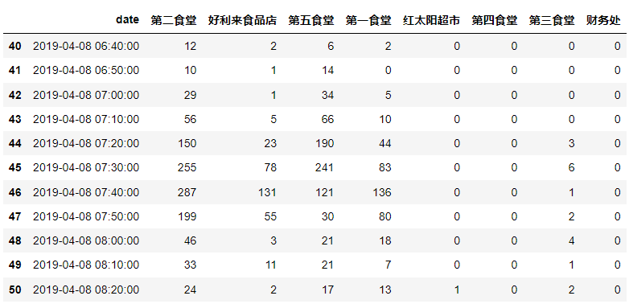

# Multivariate Time-series Data
In this GitHub repo, we provide two data sets that could be used for research related to the multivariate time series signals. The MIX datasets contain the number of people in different regions. Detailed description as follows.

### MIXh1
The raw data is in [https://challenge.datacastle.cn/v3/cmptDetail.html?id=177](https://challenge.datacastle.cn/v3/cmptDetail.html?id=177). The data in this repo is a collection of  327 days (20140224~20150116) hourly data from the preliminary round of the Data Castle Data Mining "Accurate Prediction of Financial Aid" Open Competition. 

This data records the sequence of student numbers based on the swipe records of campus cards at different locations on campus. It is worth noting that the data are given in the end remove the records of consumption methods of "laundry room, shower, boiling water" because these consumption methods represent the records of students in the dormitory. At the same time, those regional crowd flow that were 0 for a long period from the 20140224 to 20150116 school years were deleted.

 A demo slice of the MIXh1 data is illustrated in the following figure.

  
<b>Figure 1.</b> An example of the MIXh1 data.

